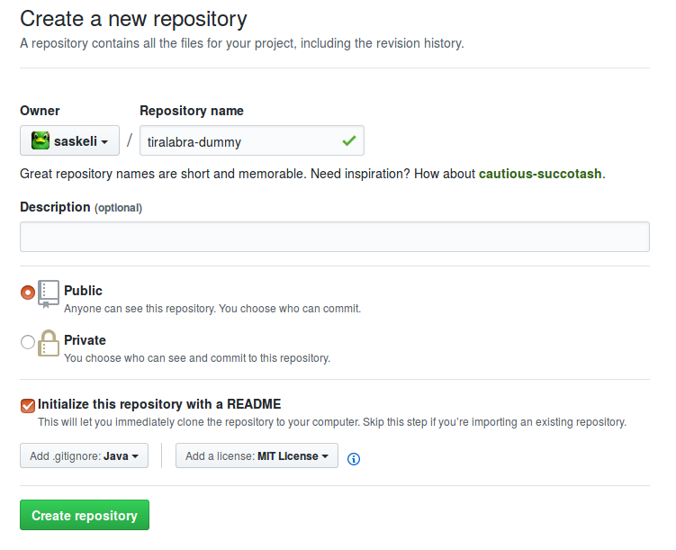
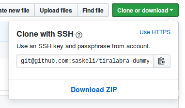
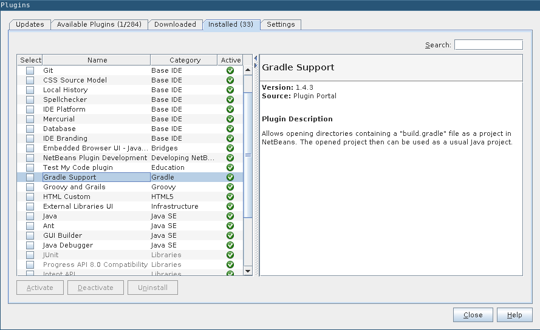
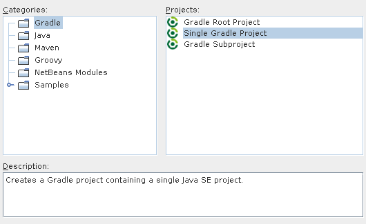
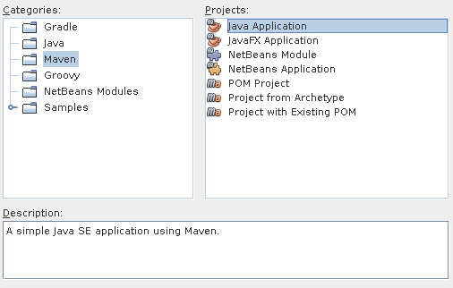
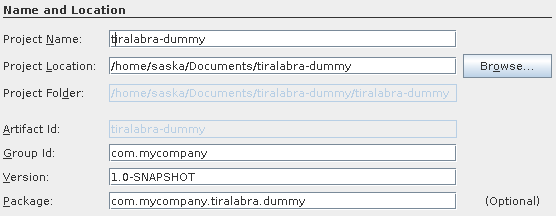
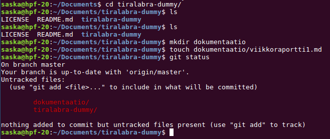

Below minimum effort was to create maven and gradle projects for java are presented. If you already know what you are doing and have your own preferred approach to project creation, you are free to disregard this document.

[Maven](https://en.wikipedia.org/wiki/Apache_Maven) and [Gradle](https://en.wikipedia.org/wiki/Gradle) are [Build automation](https://en.wikipedia.org/wiki/Build_automation) tools for java. For example, both of these make creating test coverage reports or executable jar files fairly easy.

### 1. Create a project repository

When using netbeans it's often convenient to first create the project repository since IDEs are typically able to automatically update  ```.gitignore``` files as the program progresses.



You'll probably want to check the "Initialize repository with README.md" box so the project can be instantly cloned after creation.

### 2. Clone the repository

Copy the link to the repository



Run ```git clone <linkki repoon>```

### [GRADLE only] 3a. Create a gradle project using netbeans

Check ```Tools -> Plugins``` to make sure that gradle support is installed in neabeans.



If gradle support has not been installed you can find it from the "available plugins" tab.

Go to create a new project with netbeans but select ```Gradle -> Sinlge Gradle Project``` from the settings.



Create the project in the repository you cloned.


Add at least the following lines to the `build.gradle` file. You may want to update the file later as well but that is beyond the scope of this tutorial. (Add the lines to the right place in the file. The lines already in the file should point to the right locations)

```
apply plugin: 'jacoco'

jacocoTestReport {
    reports {
        xml.enabled = true
        html.enabled = true
    }
}

check.dependsOn jacocoTestReport

```

### [MAVEN only] 3b Create a Maven project using netbeans

The project is created using the **New Project** wizard, but instead of selecting the **Java** category, select **Maven**. Now select **Java Application** from the list on the right.



On the page **Name and Location**, you should give you program a good and descriptive name. Set **Project Location** to your cloned git repository. You should also change **Group id** to your project name or at least something other than _com.mycompany.enterprising.domain_. Note that this **should not contain any caps**. This is important if you are going to do mutation texting.



The Maven project is very similar to a "normal" Java-project. The big difference is the pom.xml file that contains all the project dependacies in xml format. Add some libraries to ease testing the project.

before adding stuff your pom.xml should look a bit like this:
``` xml
<?xml version="1.0" encoding="UTF-8"?>
<project xmlns="http://maven.apache.org/POM/4.0.0" xmlns:xsi="http://www.w3.org/2001/XMLSchema-instance"
         xsi:schemaLocation="http://maven.apache.org/POM/4.0.0 http://maven.apache.org/xsd/maven-4.0.0.xsd">
    <modelVersion>4.0.0</modelVersion>
    <groupId>superohjelma</groupId>
    <artifactId>SuperOhjelma</artifactId>
    <version>0.1.0</version>
    <packaging>jar</packaging>
    <properties>
        <project.build.sourceEncoding>UTF-8</project.build.sourceEncoding>
        <maven.compiler.source>1.8</maven.compiler.source>
        <maven.compiler.target>1.8</maven.compiler.target>
    </properties>

    <!-- Stuff should be added here-->

</project>
```

The start of this xml is project specific and we will leave it alone. Instead we add some dependancies and plugins. Add the the following between the `</properties>` and `</project>` tags:
``` xml
<dependencies>
    <dependency>
        <groupId>junit</groupId>
        <artifactId>junit</artifactId>
        <version>4.12</version>
        <scope>test</scope>
    </dependency>
</dependencies>

<build>
    <plugins>
        <plugin>
            <artifactId>maven-compiler-plugin</artifactId>
            <configuration>
                <source>1.8</source>
                <target>1.8</target>
            </configuration>
            <version>3.3</version>
        </plugin>
        <plugin>
            <groupId>org.pitest</groupId>
            <artifactId>pitest-maven</artifactId>
            <version>1.1.8</version>
        </plugin>
    </plugins>
</build>
```

After adding the lines above your pom.xml shoult look something like this:

``` xml
<?xml version="1.0" encoding="UTF-8"?>
<project xmlns="http://maven.apache.org/POM/4.0.0" xmlns:xsi="http://www.w3.org/2001/XMLSchema-instance"
         xsi:schemaLocation="http://maven.apache.org/POM/4.0.0 http://maven.apache.org/xsd/maven-4.0.0.xsd">
    <modelVersion>4.0.0</modelVersion>
    <groupId>superohjelma</groupId>
    <artifactId>SuperOhjelma</artifactId>
    <version>1.0-SNAPSHOT</version>
    <packaging>jar</packaging>
    <properties>
        <project.build.sourceEncoding>UTF-8</project.build.sourceEncoding>
        <maven.compiler.source>1.8</maven.compiler.source>
        <maven.compiler.target>1.8</maven.compiler.target>
    </properties>

    <dependencies>
        <dependency>
            <groupId>junit</groupId>
            <artifactId>junit</artifactId>
            <version>4.12</version>
            <scope>test</scope>
        </dependency>
    </dependencies>

    <build>
        <plugins>
            <plugin>
                <artifactId>maven-compiler-plugin</artifactId>
                <configuration>
                    <source>1.8</source>
                    <target>1.8</target>
                </configuration>
                <version>3.3</version>
            </plugin>
            <plugin>
                <groupId>org.pitest</groupId>
                <artifactId>pitest-maven</artifactId>
                <version>1.1.8</version>
            </plugin>
        </plugins>
    </build>

</project>
```

After this mutation testing reports with test coverage can be created. Creating these reports can be made easier by doing the following:

Add a new file to your project using te **New File...** button. Select **XML -> XML Document** and name the new file **nbactions**. From the next window, select **Well-formed Document** and press Finish. Your project should now containe the _nbactions.xml_ file. Move it to the Files folder it it's not already there.

Open the file and replace the contents with:
``` xml
<?xml version="1.0" encoding="UTF-8"?>
<actions>
    <action>
        <actionName>CUSTOM-pit</actionName>
        <displayName>pit</displayName>
        <goals>
            <goal>org.pitest:pitest-maven:mutationCoverage</goal>
        </goals>
    </action>
</actions>
```

Now your project has a custom context menu where mutation and test coverage reports can be created.

### 4. Create the documentation folder and push to git

You shuould add a new folder for documentation, to keep the project neat. To an empty folder you will need to add at least one file so that git adds te folder to version control. You can for example create the first weekly report. After this you are ready to push your changes to git.


